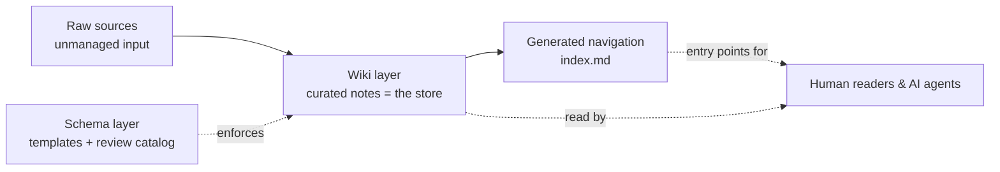

# Documentation Deployment Playbook

> An agent-first guide to building a project's base documentation. This repo is **pure
> methodology**: rules, diagrams, copyable templates and an executable bootstrap runbook. It
> dogfoods itself — the structure below follows every rule it preaches.

**The one-sentence thesis:** *the files are the store; the organization IS the index; validation
and navigation are designed, not discovered.*

## Start here (agents)

1. Read [guidelines/09-bootstrap-workflow.md](guidelines/09-bootstrap-workflow.md) — the runbook.
2. Read [guidelines/00-core-principles.md](guidelines/00-core-principles.md) — the eight principles.
3. Jump to a guideline only when the runbook's step points there. Never guess paths — the
   table below is the map.

## How to navigate this repo

| File | Purpose | When to read |
|---|---|---|
| [guidelines/00-core-principles.md](guidelines/00-core-principles.md) | The eight load-bearing principles and the anti-patterns they kill. | First principles — reached at runbook Step 1. |
| [guidelines/01-structure.md](guidelines/01-structure.md) | Three-layer model, folder anatomy, hubs, one-topic-per-file. | Before creating any folder. |
| [guidelines/02-document-contract.md](guidelines/02-document-contract.md) | Frontmatter keys, body sections, naming, dual vocabulary. | Before writing any note. |
| [guidelines/03-lifecycle-and-generated-files.md](guidelines/03-lifecycle-and-generated-files.md) | Status lifecycle (draft/active/superseded/expired; archived out of root), generated-file markers. | When docs start rotting or tools write into human files. |
| [guidelines/04-validation.md](guidelines/04-validation.md) | The review catalog: what counts as an error, what as a warning. | When the corpus stops being trustworthy. |
| [guidelines/05-agent-navigation.md](guidelines/05-agent-navigation.md) | How an AI reads the corpus: query loop, citations, sandbox, staleness. | If any consumer of the docs is a model. |
| [guidelines/06-project-md.md](guidelines/06-project-md.md) | Starting `docs/project.md`: section anatomy, the Slices routing table, bootstrap order. | Before letting an agent touch a repo. |
| [guidelines/07-agent-consumption.md](guidelines/07-agent-consumption.md) | The docs↔machine interface: five load tiers, two pipeline stages, five wiring rules. | When a model or tool consumes the docs. |
| [guidelines/08-brownfield.md](guidelines/08-brownfield.md) | Documenting an already-started project: slices first, then the ratchet. | When the repo exists before its docs do. |
| [guidelines/09-bootstrap-workflow.md](guidelines/09-bootstrap-workflow.md) | The agent bootstrap runbook: ordered steps chaining 00–08 + the Checklists. | Operational starting point — before touching any file. |
| [Templates/document-template.md](Templates/document-template.md) | Copyable contract for a new note. | On every new note. |
| [Checklists/](Checklists/) | New-note and bootstrap checklists. | After writing; before the merge. |
| [diagrams/documentation-architecture.html](diagrams/documentation-architecture.html) | Self-contained whiteboard overview of the whole system. | To get the picture in one look. |

## The system at a glance



Three operations run on the corpus, matching the three things that go wrong:

- **Intake** — new/changed notes get indexed and registered in their hub.
- **Query** — readers and agents enter through generated indexes, never by guessing paths.
- **Review** — a reader walks the catalog against changed notes; errors block the merge, warnings advise.

## Repo anatomy

```
your-project/
├── README.md              ← you are here (the single entry point)
├── guidelines/            ← the methodology (one topic per file, numbered reading order 00–09)
├── Templates/             ← the schema layer applied to this repo itself
├── Checklists/            ← executable summaries of the contract
└── diagrams/              ← derived visual artifacts, read-only, never a source of truth
```
