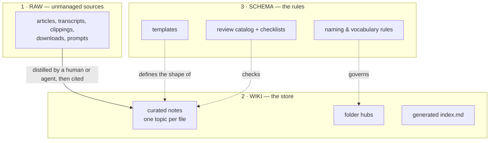

# Structure: How the Bibliography Is Deployed

## Problem

A flat pile of good notes is still unfindable. Folders organized by *who wrote what* or *when it
was added* rot into graveyards. Readers need a layout where the shape of the tree itself tells you
where to look.

## Solution

### The three layers



- **Raw** is optional but valuable: where sources sit *before* being distilled. It is kept
  **outside** the served/navigated root, so readers never mistake a clipping for curated truth.
- **Wiki** is the corpus itself — the only layer a query tool walks by default.
- **Schema** is what makes wiki self-checking: templates plus the review catalog and the
  checklists that make walking it repeatable. A schema nobody checks is a wish.

### Folder anatomy

```
corpus/
├── README.md            ← THE entry point: what this corpus is, how to navigate, the rules
├── index.md             ← generated: overview stats + full tree with ids (marker-delimited)
├── tag-index.md         ← generated: tag → docs inverted index (marker-delimited)
├── templates/           ← schema layer: the document contract, made copyable
├── checklists/          ← schema layer in prose: validation you run by hand
├── adrs/                ← decision records (append-only)
│   ├── adr-index.md     ← the hub: lists the adr-NNNN-<slug>.md files
│   └── adr-0001-<slug>.md
├── <topic-folder>/       ← ONE folder per major area (2–7 folders beats 30 shallow ones)
│   ├── <topic>-index.md ← the hub: gatekeeper of the folder
│   └── note-a.md        ← notes: one topic per file
└── diagrams/            ← derived visual artifacts (read-only, never source of truth)
```

The tag index is rebuilt by the same pipeline as `index.md` (see
[03-lifecycle-and-generated-files.md](03-lifecycle-and-generated-files.md)).

Rules that make the tree navigable:

1. **One topic per file.** A note answering three questions is three notes with bad links.
2. **Every folder has exactly one hub** (`<folder>-index.md`): what belongs here, what's in here
   (linked list), what belongs elsewhere. The hub is the *only* file a newcomer reads to enter a
   folder — so a note missing from its hub is invisible (an error at review time — the
   missing-from-hub check; see [04-validation.md](04-validation.md)). Fallback for schema
   folders: a note in a folder *without* a hub (`templates/`, `checklists/`) registers via a
   resolvable markdown link in the entry point's navigation table instead.
3. **Folders are stable nouns.** Renames are cheap only if links are resolved, never hardcoded
   paths — which is why references go through ids/stems (see
   [02-document-contract.md](02-document-contract.md)).
4. **Derived artifacts are referenced, never referenced-from.** Generated files and `diagrams/`
   point back to prose; no note depends on them to be understood.
5. **Names are lowercase kebab-case** (`payments-flow.md`, `adrs/`, `templates/`, `checklists/`) —
   the same shape as the `id` slug (see [02-document-contract.md](02-document-contract.md) §3). The
   conventional root `README.md` (and its non-Markdown siblings such as `LICENSE`) is the only
   exemption; no other capital, space or underscore. The rule binds files and folders at every
   depth, starting with the schema folders.

### Sizing

The layout holds well into the low thousands of notes. If a folder exceeds ~30 notes, split it —
a hub that reads like a phone book stops routing.

### Doc classes — registered sheet shapes

A **doc class** is a recurring sheet shape with a fixed internal anatomy: a note in a topic
folder under the standard frontmatter contract, registered here and made copyable as a Template.
Three classes are registered:

| Class | Answers | Keyed by | Copyable shape |
|---|---|---|---|
| Interface-surface sheet | what a group exposes (catalog mode) and what its payloads guarantee (contract mode) | functional group / area — NOT per slice | [../templates/interface-surface-template.md](../templates/interface-surface-template.md) |
| UI inventory sheet | which surface to pick, what each one is, how it is used | one inventory per folder; selection guide first | [../templates/ui-inventory-template.md](../templates/ui-inventory-template.md) |
| Troubleshooting sheet | why a symptom happens and how to fix it | exact symptom string as the H2 | [../templates/troubleshooting-template.md](../templates/troubleshooting-template.md) |

Rules:

- **Membership rides on `tags`** — an interface-surface sheet picks its mode by tag (e.g.
  `interface-catalog` / `interface-contract`), never by a new frontmatter key; inventing keys is
  a metadata-outside-contract error (see [02-document-contract.md](02-document-contract.md)).
- **Body-shape exception**: each class keeps its documented anatomy; the exception is granted in
  [02 §2](02-document-contract.md#2-standard-body-sections-7-verbatim-headings-in-order). The
  frontmatter contract is unchanged for every class.
- **Interface-surface sheets are group-keyed**: many slices cross-link to one group sheet —
  several slice rows may name it as their primary doc (see [06-project-md.md](06-project-md.md)).
- **Troubleshooting symptom headings are exact strings**: the string doubles as the grep target
  and the Common-Lookups routing key (interplay rule in [06-project-md.md](06-project-md.md)).

### Placement decisions — when to add / when NOT to add

Ask what kind of thing you're about to write, then stop at the first match:

| The thing is… | It goes… |
|---|---|
| a new durable answer | a note in a topic folder + registration in its hub |
| a recurring symptom string | **Common Lookups** in `project.md` (see [06-project-md.md](06-project-md.md)) |
| a group's surface catalog or payload contract | an **interface-surface sheet** in the group's folder — [../templates/interface-surface-template.md](../templates/interface-surface-template.md) |
| an inventory readers choose among (components, styles, tokens) | a **UI inventory sheet** — [../templates/ui-inventory-template.md](../templates/ui-inventory-template.md) |
| a symptom write-up (root cause + fix) | a **troubleshooting sheet** — [../templates/troubleshooting-template.md](../templates/troubleshooting-template.md); the *routing string* itself goes to Common Lookups in `project.md` |
| a rule that governs shape | contract text in [02-document-contract.md](02-document-contract.md) + an ADR if it changes the schema |
| a new copyable shape others should instantiate | a Template in `templates/` (+ registration in the README navigation table) — not if it merely restates contract text in [02-document-contract.md](02-document-contract.md) |
| a procedure you run by hand | a Checklist |
| a decision that was debated | an ADR under `adrs/` (append-only) |
| a source awaiting distillation | Raw (outside the served root) |
| a visual overview | `diagrams/` — derived only, never a source of truth |

When nothing matches: **do not create a file that only duplicates a hub row**, and **do not
pre-create folders** (see the speculative-tree rule under "When not to use").

## When to use

Any time you create a folder or file in a documentation corpus — including this one.

## When not to use

Do not pre-create empty topic folders "for structure". The tree grows into its shape from real
content; speculative taxonomies are the fastest route to graveyard folders.

## Examples

See the micro-vault inline in [09-bootstrap-workflow.md](09-bootstrap-workflow.md): two topic
notes, their hubs, and the generated-region markers in one fenced view.

## Common mistakes

- Organizing by document type instead of topic (`/references`, `/howtos`, `/notes`): a reader
  looking for *refunds* must consult three folders. Topic first, type is metadata (frontmatter).
- Hubs that duplicate note content. A hub routes and catalogs; it never restates. Duplication is
  a warning (the near-duplicate-body check) and future drift.
- A second "entry point". If README, index, home and docs/README all open with "start here",
  navigation is a maze. Exactly one root entry point; everything else is a hub *below* it.

## References

- The contract each file inside the layout must satisfy:
  [02-document-contract.md](02-document-contract.md)
- How agents exploit this layout at query time: [05-agent-navigation.md](05-agent-navigation.md)
