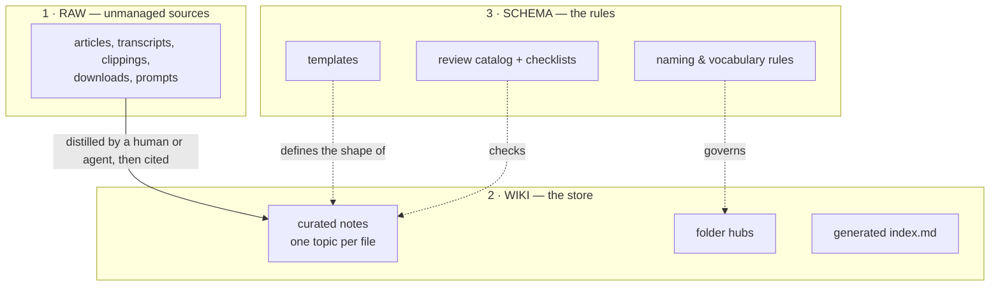

# Structure: How the Bibliography Is Deployed

## Problem

A flat pile of good notes is still unfindable. Folders organized by *who wrote what* or *when it
was added* rot into graveyards. Readers need a layout where the shape of the tree itself tells you
where to look.

## Solution

### The three layers



- **Raw** is optional but valuable: where sources sit *before* being distilled. It is kept
  **outside** the served/navigated root, so readers never mistake a clipping for curated truth.
- **Wiki** is the corpus itself — the only layer a query tool walks by default.
- **Schema** is what makes wiki self-checking: templates plus the review catalog and the
  Checklists that make walking it repeatable. A schema nobody checks is a wish.

### Folder anatomy

```
corpus/
├── README.md            ← THE entry point: what this corpus is, how to navigate, the rules
├── index.md             ← generated: overview stats + full tree with ids (marker-delimited)
├── Templates/           ← schema layer: the document contract, made copyable
├── Checklists/          ← schema layer in prose: validation you run by hand
├── <TopicFolder>/       ← ONE folder per major area (2–7 folders beats 30 shallow ones)
│   ├── <topic>-index.md ← the hub: gatekeeper of the folder
│   └── note-a.md        ← notes: one topic per file
└── diagrams/            ← derived visual artifacts (read-only, never source of truth)
```

Rules that make the tree navigable:

1. **One topic per file.** A note answering three questions is three notes with bad links.
2. **Every folder has exactly one hub** (`<folder>-index.md`): what belongs here, what's in here
   (linked list), what belongs elsewhere. The hub is the *only* file a newcomer reads to enter a
   folder — so a note missing from its hub is invisible (an error at review time — the
   missing-from-hub check; see [04-validation.md](04-validation.md)).
3. **Folders are stable nouns.** Renames are cheap only if links are resolved, never hardcoded
   paths — which is why references go through ids/stems (see
   [02-document-contract.md](02-document-contract.md)).
4. **Derived artifacts are referenced, never referenced-from.** Generated files and `diagrams/`
   point back to prose; no note depends on them to be understood.

### Sizing

The layout holds well into the low thousands of notes. If a folder exceeds ~30 notes, split it —
a hub that reads like a phone book stops routing.

## When to use

Any time you create a folder or file in a documentation corpus — including this one.

## When not to use

Do not pre-create empty topic folders "for structure". The tree grows into its shape from real
content; speculative taxonomies are the fastest route to graveyard folders.

## Examples

See the micro-vault inline in [09-bootstrap-workflow.md](09-bootstrap-workflow.md): two topic
notes, their hubs, and the generated-region markers in one fenced view.

## Common mistakes

- Organizing by document type instead of topic (`/references`, `/howtos`, `/notes`): a reader
  looking for *refunds* must consult three folders. Topic first, type is metadata (frontmatter).
- Hubs that duplicate note content. A hub routes and catalogs; it never restates. Duplication is
  a warning (the near-duplicate-body check) and future drift.
- A second "entry point". If README, index, home and docs/README all open with "start here",
  navigation is a maze. Exactly one root entry point; everything else is a hub *below* it.

## References

- The contract each file inside the layout must satisfy:
  [02-document-contract.md](02-document-contract.md)
- How agents exploit this layout at query time: [05-agent-navigation.md](05-agent-navigation.md)
