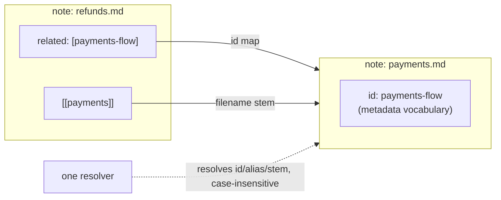

# The Document Contract

## Problem

Consistency cannot be reviewed into existence. If each note chooses its own metadata keys and
headings, no tool — and no agent — can rely on any of them, and manual maintenance becomes the
corpus bottleneck.

## Solution

Every note in the wiki layer is a copy of the **template**: fixed metadata on top, fixed sections
below. The contract has three parts.

### 1. Required frontmatter keys (7 + 2 optional)

| Key | Type | Meaning | Validation |
|---|---|---|---|
| `id` | slug | Stable semantic name — the citation anchor | present, unique corpus-wide, slug format |
| `category` | string | Owning folder / domain | present; should match the folder (warning if not) |
| `tags` | list | Cross-cutting facets for grep-ability | present (empty list ok, key not) |
| `aliases` | list | Alternate names readers might type | present; resolved case-insensitively |
| `related` | list of ids | Semantic connections (vocabulary: **ids**) | present; every target must resolve |
| `version` | number | Contract/content revision | present |
| `status` | enum | Lifecycle (see [03](03-lifecycle-and-generated-files.md)) | present; one of the enum values |
| `supersedes` | id | Note this one replaces | optional; format-checked only when present |
| `expires_at` | `YYYY-MM-DD` | Forced review date | optional; strict format when present; **absent ≡ never expires** |

Iron rules:

- An optional key that is **present but blank** is an error. Omit it entirely.
- The keys never get renamed or translated — they are the API between writers and tools.

### 2. Standard body sections (7, verbatim headings, in order)

```
# Title (H1)
## Problem        ← why this note exists, in 1–2 sentences
## Solution       ← the substance
## When to use    ← applicability, concretely
## When not to use ← anti-applicability: the fastest way to kill mis-citation
## Examples       ← worked instances or code
## Common mistakes ← frequent pitfalls (densest value per line in the whole note)
## References     ← links onward: wikilinks to other notes, sources outside
```

Why all seven: the *shape* is what lets a reader stop reading early. "When not to use" plus
"Common mistakes" are what make an AI's citation trustworthy — they carry the note's boundaries.

Hubs may shorten sections but must keep the complete frontmatter. Nothing outside the wiki layer
(config files, generated artifacts) carries the note contract.

### 3. Naming and the dual vocabulary

Two link vocabularies coexist on purpose:



- **`related` uses ids** (`payments-flow`): semantic, survives file moves and renames.
- **Wikilinks use filename stems** (`[[payments]]`): structural, native to the editor's link
  graph, zero ceremony.
- **One resolver must accept both** — plus aliases — case-insensitively, in every direction.
  Writers must never ask "which vocabulary does this tool speak?"

Unresolved references in `related`/wikilinks are errors at review (the dangling-target and
dangling-link checks); the asymmetry is deliberate: prose markdown links are visible to tools but
not graph-critical — unless the corpus has no vault, where relative links inherit the structural
role (see [04-validation.md](04-validation.md)).

## When to use

Every new note, before writing a word of prose — copy `Templates/document-template.md`.

## When not to use

Repo-level documentation (this file included) may use the lighter *context-doc* contract
(`last_updated`, `status`, `description`, `tags`) when the seven-key ceremony adds no value to a
consumer — but pick one contract per audience and never mix them in one folder.

## Examples

The copyable version lives at [`../Templates/document-template.md`](../Templates/document-template.md);
the contract instantiated (tree complete, bodies abbreviated) — a micro-vault — in
[`../guidelines/09-bootstrap-workflow.md`](../guidelines/09-bootstrap-workflow.md).

## Common mistakes

- Omitting a key with no value (`aliases` on a note without aliases): the key stays, list empty.
  Tools parse the *shape*, not the sentiment.
- Renaming a section ("Usage" instead of "When to use"): breaks outline parsing and makes every
  diff look structural.
- Choosing destinations for `related` as filler: links carry graph meaning (orphan detection,
  backlinks); decorative links make islands undetectable and hubs noisy.
- Making the id and the stem diverge gratuitously (`id: pay`, file `payments.md`): legal, but
  every reader pays your naming cleverness in lookup cost. Keep id ≈ stem + category where possible.

## References

- Lifecycle of `status` / `supersedes` / `expires_at`:
  [03-lifecycle-and-generated-files.md](03-lifecycle-and-generated-files.md)
- How the contract is reviewed: [04-validation.md](04-validation.md)
