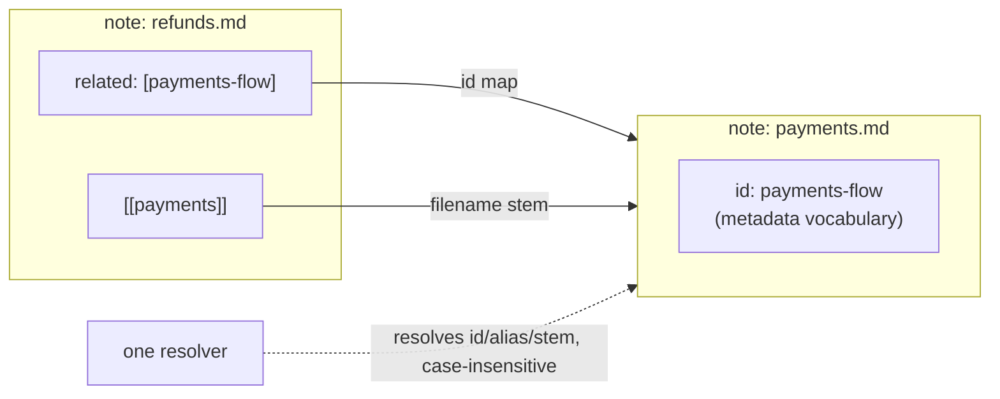

# The Document Contract

## Problem

Consistency cannot be reviewed into existence. If each note chooses its own metadata keys and
headings, no tool — and no agent — can rely on any of them, and manual maintenance becomes the
corpus bottleneck.

## Solution

Every note in the wiki layer is a copy of the **template**: fixed metadata on top, fixed sections
below. The contract has four parts.

### 1. Required frontmatter keys (7 + 3 optional)

| Key | Type | Meaning | Validation |
|---|---|---|---|
| `id` | slug | Stable semantic name — the citation anchor | present, unique corpus-wide, slug format |
| `category` | string | Owning folder / domain | present; should match the folder (warning if not) |
| `tags` | list | Cross-cutting facets for grep-ability | present (empty list ok, key not) |
| `aliases` | list | Alternate names readers might type | present; resolved case-insensitively |
| `related` | list of ids | Semantic connections (vocabulary: **ids**) | present; every target must resolve |
| `version` | number | Contract/content revision | present |
| `status` | enum | Lifecycle (see [03](03-lifecycle-and-generated-files.md)) | present; one of the enum values |
| `supersedes` | id | Note this one replaces | optional; format-checked only when present |
| `expires_at` | `YYYY-MM-DD` | Forced review date | optional; strict format when present; **absent ≡ never expires** |
| `moved_from` | list of former paths | Provenance after a move (see [08](08-brownfield.md)) | optional; omit entirely when unused |

Iron rules:

- An optional key that is **present but blank** is an error. Omit it entirely.
- The keys never get renamed or translated — they are the API between writers and tools.
- Version bumps follow the policy in [03 §4](03-lifecycle-and-generated-files.md#4-version-bump-policy).

### 2. Standard body sections (7, verbatim headings, in order)

```
# Title (H1)
## Problem        ← why this note exists, in 1–2 sentences
## Solution       ← the substance
## When to use    ← applicability, concretely
## When not to use ← anti-applicability: the fastest way to kill mis-citation
## Examples       ← worked instances or code
## Common mistakes ← frequent pitfalls (densest value per line in the whole note)
## References     ← links onward: wikilinks to other notes, sources outside
```

Why all seven: the *shape* is what lets a reader stop reading early. "When not to use" plus
"Common mistakes" are what make an AI's citation trustworthy — they carry the note's boundaries.

Optionally, the single highest-consequence section heading may carry a ` (CRITICAL)` suffix —
`## Solution (CRITICAL)`. The seven verbatim names stay intact: the marker decorates, tools
match on prefix. Never more than one per note.

Hubs may shorten sections but must keep the complete frontmatter. Nothing outside the wiki layer
(config files, generated artifacts) carries the note contract.

Contracted exceptions are docs of **registered doc classes** — each class keeps its documented
body shape: the slice-generalities docs mandated by [08-brownfield.md](08-brownfield.md)
(08, Step 1), and the interface-surface, UI-inventory, and troubleshooting sheet classes
registered in [01-structure.md](01-structure.md). In every case the frontmatter contract is
unchanged, and a class must not invent frontmatter keys.

### 3. Naming and the dual vocabulary

**File and folder names are lowercase kebab-case.** A filename is lowercase alphanumerics joined by
single hyphens (`02-document-contract.md`, `adr-0001-methodology-expansion-2026-09-07.md`), and a
folder is the same shape without the extension (`guidelines/`, `adrs/`, `templates/`,
`checklists/`) — never a capital, a space or an underscore. It is the same shape as the `id` slug
(§1): keep the stem ≈ the id. The conventional all-caps root file `README.md` (and its non-Markdown
siblings such as `LICENSE`) is the **one documented exemption** — the spelling every reader and tool
already expects; any other uppercase name is a naming error (the *non-kebab-case name* check in
[04-validation.md](04-validation.md)). The rule binds files and folders at every depth, including
the schema folders (`adrs/`, `templates/`, `checklists/`), so links and folder classification can
never disagree on case.

The link vocabulary is separate from the naming of files:

Two link vocabularies coexist on purpose:



- **`related` uses ids** (`payments-flow`): semantic, survives file moves and renames.
- **Wikilinks use filename stems** (`[[payments]]`): structural, native to the editor's link
  graph, zero ceremony.
- **One resolver must accept both** — plus aliases — case-insensitively, in every direction.
  Writers must never ask "which vocabulary does this tool speak?"

Unresolved references in `related`/wikilinks are errors at review (the dangling-related-target
and dangling-link checks); the markdown-link vs wikilink asymmetry is now semantic — one
vocabulary is for the graph, one for the prose — not conditional on a vault: the structural-graph
role of relative links is checked unconditionally. Syntax citations are exempt — inside fenced
code blocks for both kinds, plus inline code spans for wikilinks (see
[04-validation.md](04-validation.md) for exact check semantics).

### 4. The context-doc contract

Guidelines and repo-level docs are **context-docs** — the note ceremony (ids, aliases) adds
nothing for their audience, so they carry their own key set:

| Key | Type | Meaning |
|---|---|---|
| `last_updated` | `YYYY-MM-DD` | Date of the last substantive change |
| `status` | enum | Lifecycle claim (see [03](03-lifecycle-and-generated-files.md)) |
| `description` | string | One-line summary for navigation tables |
| `tags` | list | Cross-cutting facets |
| `version` | number | Contract/content revision (bump policy: [03 §4](03-lifecycle-and-generated-files.md#4-version-bump-policy)) |

Optional: `related` (list), `moved_from` (list of former paths) — present-but-blank is an error
here too; omit entirely.

Because context-docs carry no `id`, their `related` entries resolve as **filename stems**. The
entry point (the root README) adds one extra required key, `doc_language`, declared once
corpus-wide.

**One contract per folder**: a folder serves notes or context-docs, never both. Validator
consequence: the *metadata outside the contract* check (see
[04-validation.md](04-validation.md)) selects between two key sets by file class — the note keys
of §1, the context-doc keys above.

## When to use

Every new note, before writing a word of prose — copy `templates/document-template.md`.

## When not to use

Repo-level documentation (this file included) uses the lighter *context-doc* contract,
formalized in §4 above — pick one contract per audience and never mix them in one folder.

## Examples

The copyable version lives at [`../templates/document-template.md`](../templates/document-template.md);
the contract instantiated (tree complete, bodies abbreviated) — a micro-vault — in
[`../guidelines/09-bootstrap-workflow.md`](../guidelines/09-bootstrap-workflow.md).

## Common mistakes

- Omitting a key with no value (`aliases` on a note without aliases): the key stays, list empty.
  Tools parse the *shape*, not the sentiment.
- Renaming a section ("Usage" instead of "When to use"): breaks outline parsing and makes every
  diff look structural.
- Choosing destinations for `related` as filler: links carry graph meaning (orphan detection,
  backlinks); decorative links make islands undetectable and hubs noisy.
- Making the id and the stem diverge gratuitously (`id: pay`, file `payments.md`): legal, but
  every reader pays your naming cleverness in lookup cost. Keep id ≈ stem + category where possible.

## References

- Lifecycle of `status` / `supersedes` / `expires_at`:
  [03-lifecycle-and-generated-files.md](03-lifecycle-and-generated-files.md)
- How the contract is reviewed: [04-validation.md](04-validation.md)
