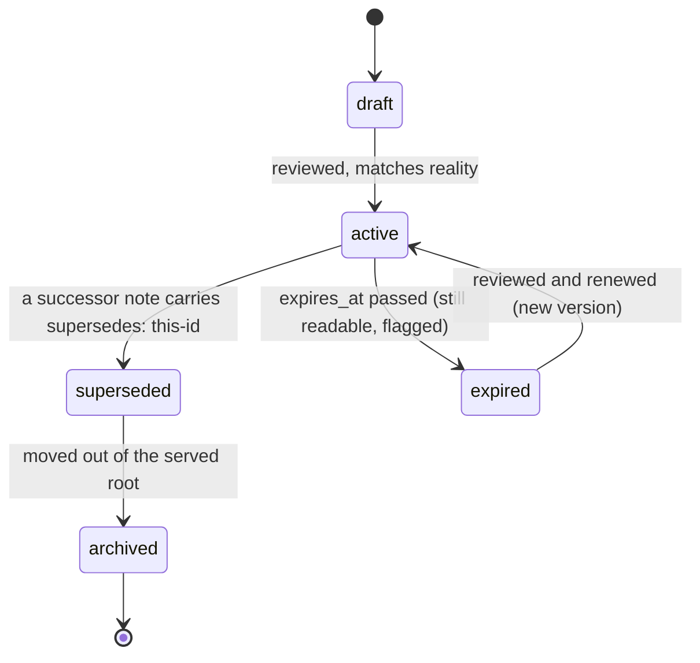

# Lifecycle & Generated Files

## Problem

Two different rot mechanisms destroy corpora: documents that silently become false, and tools
that regenerate files straight through the human edits embedded in them. Both need *contracts*,
not goodwill.

## Solution

### 1. Document lifecycle



- **`status` is a claim, not a mood.** `active` means "trust this"; anything else means "read with
  suspicion". The enum is fixed; a status outside it is an error at review.
- **Supersede, don't rewrite.** When knowledge is replaced, write the successor with
  `supersedes: old-id` and flip the predecessor's status — the old note stays as history with a
  pointer forward. Decision records (ADRs) are *append-only by contract*: an addendum block, never
  an edit of the original text.
- **`expires_at` is for claims with a shelf life** (roadmaps, version-bound behavior, "as of
  2026-09"). Strict `YYYY-MM-DD`, format-checked only when present. An expired-but-`active` note
  is the classic first row to add to your catalog — 04 invites extending it "with what actually
  bites you".

### 2. Generated-file contract

Root `index.md` (and any hub that aggregates) is machine-generated in **marker-delimited regions**:

```markdown
This text is human-owned and survives regeneration.

<!-- BEGIN GENERATED: overview -->
## Overview
- Notes indexed: 4
…
<!-- END GENERATED: overview -->
```

Binding rules for every generated artifact:

1. **Regions, not files.** Human notes live outside the markers; tools touch only their regions.
2. **Write-if-diff.** Byte-stable output on unchanged input → zero VCS noise, meaningful diffs,
   committable artifacts. A generated file that dirties the working tree on every run is broken.
3. **The generator reads, humans review.** `index.md` shows counts, the tree, and hub pointers —
   it is the *first page* an agent reads (see [05-agent-navigation.md](05-agent-navigation.md)).
4. **Generated content is rebuilt, never rescued.** If a generated region is lost or corrupted,
   rerunning the generator restores it with zero hand-editing. If the generator can't rebuild it,
   it was never generated content — it belongs outside the markers.

### 3. Staleness must be visible

Every generated file carries the date of the snapshot it represents — a footer date is enough.
Silent staleness is a lie by omission; visible staleness lets the reader decide.

## When to use

The moment the corpus is used by anything automated, or grows past "I remember everything".

## When not to use

A three-file scratch repo doesn't need generated regions; adopt the lifecycle the first time an
unread doc's trustworthiness gets questioned, and markers the first time a tool writes into a
human file.

## Examples

A filled instance of every marker rule, including a generated index region, sits inline in
[`../guidelines/09-bootstrap-workflow.md`](../guidelines/09-bootstrap-workflow.md).

## Common mistakes

- Editing an ADR "for clarity" — a decision record that can be rewritten is marketing, not
  archaeology. Add an addendum.
- Regenerating `index.md` wholesale — the human introduction at the top is why the file is
  readable at all. Markers exist precisely to prevent this.
- Marking everything `expires_at` out of anxiety — expiry noise trains readers to ignore the field.

## References

- Where `status`/`supersedes`/`expires_at` are defined:
  [02-document-contract.md](02-document-contract.md)
- Making corpus health a routine review: [04-validation.md](04-validation.md)
