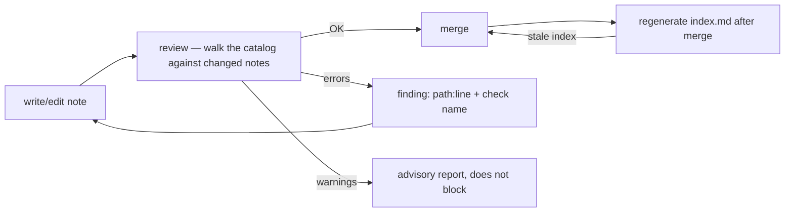

# Validation: The Corpus Is Reviewed, Not Trusted

## Problem

"Keep the docs updated" is not a mechanism. Without a review that answers *is this corpus
trustworthy right now?* against an explicit catalog of checks, every trust claim in the notes
decays at the speed of reality.

## Solution

One habit: before a change is merged, a reader walks an explicit catalog of checks split into two
severities: **errors block the merge**, **warnings advise** (never block). The catalog below is
the distilled starting set — eight errors, three warnings; adopt it wholesale and extend it only
with what actually bites you.

### Error catalog (blocks the merge)

| Check | What it catches | Catches which rot |
|---|---|---|
| **metadata outside the contract** | All required frontmatter keys present, `status` in enum, optional lifecycle keys format-valid **only if present** | metadata drift, "mood statuses" |
| **duplicate ids** | The same id claimed by more than one note | two truths claiming one name |
| **dangling related target** | A `related` entry that resolves to no note | graph rot in the semantic vocabulary |
| **dangling link** | Wikilinks (`[[stem]]` not resolving id/stem/alias) **and** relative markdown links (missing target path) — both checked unconditionally, no vault distinction. Links inside fenced code blocks are exempt for both kinds; inline code spans exempt wikilinks only: a citation is not a link (mirrors editor rendering) and the citation exemption must never be used to smuggle live markdown links | graph rot in the structural vocabulary |
| **orphan note** | Zero resolved, non-self edges | content invisible to navigation |
| **missing from its hub** | A note not listed in its hub (via wikilink **or** internal markdown link); folders without a hub (`Templates/`, `Checklists/`) register in the entry-point navigation table instead (see [01](01-structure.md)) — the brownfield twin and its gap-close loop live in [08](08-brownfield.md) | new content that no entry path reaches |
| **stale generated index** | Generated index out of sync with the files it indexes (covers both `index.md` and `tag-index.md` — a stale tag index is the same check) | stale entry point |
| **secret in prose** | Secret-like tokens in prose or frontmatter (fenced blocks exempt) | accidental credential commits |

### Warning catalog (advisory)

| Check | What it catches | Why not an error |
|---|---|---|
| **no H1 title** | A note missing its H1 | cosmetic, but worth flagging |
| **category ≠ folder** | `category` disagrees with the folder the note sits in | cheap to fix, not cheap to enforce |
| **near-duplicate body** | Body near-duplicate of another note (word-token Jaccard ≥ 0.85, skip <25-token notes, one finding per pair) | duplication needs human judgment to resolve |

### Design rules for the catalog

1. **Every check must be objective and calibratable — two walkers reach the same verdict.** Before adopting the catalog, walk it
   once against the corpus as it exists and demand zero gaps — or write down, explicitly, what you
   tolerate as accepted debt; a catalog nobody finishes walking is worse than none. A noisy check
   gets ignored within a week.
2. **Review findings cite a location** — `path:line` at minimum, one finding per issue, named
   after its check. An author — or an agent — must be able to self-correct from the finding alone.
3. **Never echo secrets** in "secret in prose" findings — label the token kind, show the line
   number, redact the value. Review notes get shared; the value itself must never travel.
4. **Errors = contract violations; warnings = taste.** If a warning never changes behavior,
   delete it; if an error is routinely silenced, it's a design smell in the contract.
5. **Reviewers read everything, change nothing.** The reviewer reports, the author fixes. The query
   paths of the corpus stay read-only (see [05-agent-navigation.md](05-agent-navigation.md)).
6. **Validation speaks one vocabulary: the contract.** Never invent review checks that contradict
   the template — the template is the specification and the catalog is its translation.

### Pipeline placement

## When to use

From the second contributor — human or agent. Make the walk a step of every merge the day a real
error surprises you.

## When not to use

Checks about *prose quality* (length, style, tone) don't belong here — judgment that can't be
reduced to a clear verdict masquerading as a catalog row erodes trust in the whole catalog.

## Examples

A minimum viable review is the two Checklists:
[../Checklists/new-note-checklist.md](../Checklists/new-note-checklist.md) walks one note,
[../Checklists/bootstrap-checklist.md](../Checklists/bootstrap-checklist.md) walks the corpus.
No tools required; a shared vocabulary of check names is the whole machinery.

The catalog also has a machine walk: root `validate.js` — run `node validate.js`. Findings print
as `path:line — check-name: message`; exit code 1 on errors; `--write` regenerates the generated
regions, write-if-diff. The Checklists remain the minimum no-tool path.

## Common mistakes

- Launching with a "comprehensive" catalog nobody calibrated: the first thing contributors learn
  is to skip the review.
- Reviewing only on merge: findings at authoring time are cheap; findings that block a merge are
  argued with.
- Forgetting the *why* of "missing from its hub": a perfectly formatted, well-linked note that no
  hub mentions is still unreachable through `entry → hub → note`. "orphan note" and "missing from
  its hub" are the navigation guarantees, not the graph ones.

## References

- The contract being checked: [02-document-contract.md](02-document-contract.md)
- Staleness and the "stale generated index" check:
  [03-lifecycle-and-generated-files.md](03-lifecycle-and-generated-files.md)
