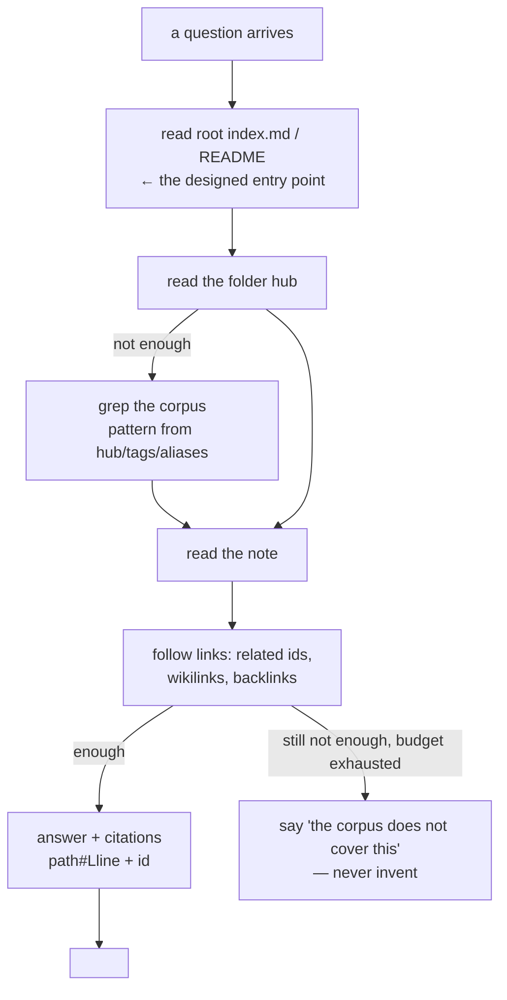

# Agent Navigation: Reading the Corpus on Purpose

## Problem

An AI consumer browsing a documentation corpus with raw filesystem tools will: escape the corpus,
write into it, invent paths, miss links, cite things it didn't read, and trust a stale snapshot
forever. The corpus must be *deployed* so that the correct loop is the easy loop.

## Solution

### 1. The query loop

The navigation design (entry point → hubs → notes) is what makes an agentic search loop work
with nothing but the filesystem:

Corollaries for the corpus designer:

- The loop's first hop must be **cheap and mandatory** → the root index has to exist, be fresh
  (the stale-generated-index check owns that) and short enough to read whole.
- Every note reachable in ≤ 3 hops from the entry point, or it effectively doesn't exist
  (guaranteed by the orphan-note and missing-from-hub checks when hubs and links are honest).
- `tags` and `aliases` exist because grep is the loop's fallback: they are the *vocabulary the
  question will arrive in*, so fill them with what searchers type, not what taxonomists like.
- **Two generated lookup surfaces** front that fallback: `index.md` (tree + ids) and
  `tag-index.md` (tag → docs inverted index). When a task arrives in unknown vocabulary, resolve
  it through the tag index — and the Common Lookups symptom strings of
  [06-project-md.md](06-project-md.md) — *before* falling back to grep.
- **Class-fixed shapes are query surfaces** (doc classes: [01-structure.md](01-structure.md)):
  a troubleshooting symptom heading is the exact grep target; the UI inventory's fast anchor
  index and the group-keyed interface sheet keep "one question → one hop" honest. When the
  loop's question arrives in unknown vocabulary, the tag index and the Common Lookups should
  resolve INTO these class docs.

### 2. Result semantics are part of the contract

If the corpus is exposed through any tool surface (search script, agent function):

- **Not-found is data, not an error**: JSON `null` for a document/path, `[]` for lists. A protocol
  error per missing note trains agents to treat normal exploration as failure.
- **Genuine misuse is an error** — bad arguments, sandbox refusals — returned as a result the
  agent can read and self-correct from.
- Every result carries its **snapshot age** (a date on generated files is the minimum): the loop
  must be able to tell "absent" from "not yet indexed".

### 3. Citations are structural, not decorative

The reader's claim "this says X" must be checkable: resolve a document to its section outline
with start lines, so answers cite `path#Lstart` (or `id + heading`). Notes built on the standard
sections (see [02-document-contract.md](02-document-contract.md)) outline perfectly, which is
why the fixed headings pay off for agents beyond style.

### 4. The sandbox is non-negotiable

When an agent reads the corpus, every user-supplied path flows through a jail that rejects
absolute paths, `..`, and symlink escapes; the corpus is mounted **read-only**; the
"query tools never write" invariant holds even for well-intentioned maintenance ops.
This is an attack surface that only exists once you let machines touch files — design it in
from day one.

## When to use

Any time a model reads the corpus — even informally via shell tools — audit it against the loop:
if step 1 requires guessing paths, the deployment is wrong, not the model.

## When not to use

Corpora that are *written but never queried by machines* don't need the tool surface — but the
navigation design (sections 1's corollaries) still earns its keep for the human readers, so there
is rarely a real "not to use" here.

## Examples

The micro-vault inline in [`../guidelines/09-bootstrap-workflow.md`](../guidelines/09-bootstrap-workflow.md)
is loop-ready: its index names both hubs and lists both notes, and the shown note cites the other
through both vocabularies (hubs and the reciprocal link are what you build in runbook Steps 3–4).

## Common mistakes

- Letting agents guess paths (`grep -r` from the disk root): correct answers by luck, invisible
  failures by silence.
- Treating the query surface as the place to fix recall with cleverer prompts — usually it's a
  missing hub or an id/stem divergence.
- Forgetting the loop's exit: an agent without a "corpus does not cover this" instruction will
  cite adjacent-but-wrong notes confidently. The gap answer is part of the contract.

## References

- The layout this loop walks: [01-structure.md](01-structure.md)
- The checks that keep every hop valid: [04-validation.md](04-validation.md)
