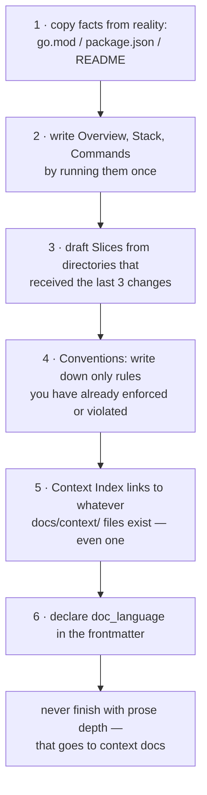

# Starting `project.md`: The Agent-Facing Entry Point

## Problem

A README talks to humans who already chose to arrive. An AI agent starts every session cold: it
must guess what the repo is, how it's built, where its boundaries are, and which subarea owns a
task. If those answers aren't in one machine-consumable place, every agent turn burns budget
rediscovering (or inventing) them. Guessing at entry level propagates through every downstream
delegation.

## Solution

`docs/project.md` is the **canonical entry point, loaded into every agent session** (see
[07-agent-consumption.md](07-agent-consumption.md) for the wiring). It is not a README: it is a
contract with fixed sections whose shape downstream consumers rely on. Depth does not live here —
one topic per strategic doc in `docs/context/`, linked from the Context Index. Keep it short
(~100–150 lines); its value is *being read whole, every session*.

### Section anatomy (fixed order, fixed names)

| § | Section | Contract with agents |
|---|---|---|
| 1 | **Overview** | One paragraph: what this is, in what form (e.g. "files ARE the store — no database"). The anti-goals belong here too. |
| 2 | **Technology Stack** | Language + pinned version, frameworks, database/auth/secrets posture, architecture pattern name. Exactness beats ranges. |
| 3 | **Slices** | *The routing heart* — see below. Demarcated by humans only. |
| 4 | **Commands** | Copy-pasteable invocations for dev/serve/build/test/lint, including working directories and env quirks (toolchain paths, flags). |
| 5 | **Repository Structure** | Compact tree with one-line roles — the human-readable mirror of the hub model. |
| 6 | **Key Conventions** | Binding, checkable bullets (public API contracts, vocabulary rules, doc_language, invariants). Each is a candidate catalog row (see [04-validation.md](04-validation.md)). |
| 7 | **Domain Entities** | The corpus's nouns (Note, Hub, Edge kinds, Generated region…) with one-line definitions — the vocabulary every reader (human or machine) reconciles against. |
| 8 | **Context Index** | Links into `docs/context/*.md` + operational docs, each with purpose. The doorway, never the room. |
| 9 | **Common Lookups** | Exact user-visible symptom strings (an error message, a failed goal) as navigation keys, each pointing at doc + heading anchor — e.g. build fails with `Cannot find module 'left-pad'` → `build-notes.md#missing-modules`, or "the test runner hangs with no output" → `testing-notes.md#hangs`. |

### The Slices table

A **slice** is a major area of the codebase a human has explicitly demarcated. The table shape:

```markdown
| Slice | Description | Keywords | Entry points | Primary agents |
|---|---|---|---|---|
| api    | HTTP surface, auth, rate limits      | handler, jwt, 429, cors, openapi   | api/, api/handlers/       | coder, tester, reviewer |
| ui     | Routes, components, client state     | router, form, dialog, css, state    | src/app/, src/components/ | coder, tester           |
| docs   | Architecture notes, ADRs, onboarding | frontmatter, hub, index, adr, tag   | docs/, docs/context/      | documenter, explorer    |
```

Rules that make it work as a router:

1. **Entry points are paths**, not prose — the agent's next `read` must be determined by the row.
2. **Descriptions stay narrative; the Keywords column carries the routing tokens** users type: a
   term maps to a slice *only if the row supports it* (a routing step that guesses vocabulary
   from general knowledge instead of from the table is the documented failure mode), so the
   column is a lookup target, written densely on purpose.
3. **No match ⇒ the task pauses**: the routing agent must propose a *new slice row* and get the
   human's blessing before working. This keeps the taxonomy under human control and makes drift
   visible as a conversation, not as silent misrouting.
4. Slices describe **territory, not teams**: 2–7 rows for a small repo; split a row only when
   tasks actually land in it repeatedly.

### Slice doc types

A slice row's primary doc — the file its entry-point paths lead to — may be:

| Primary-doc type | Shape | Notes |
|---|---|---|
| Slice generalities doc | 08 Step 1's fixed shape | the default for every slice |
| Interface-surface sheet | group catalog or payload contract ([../templates/interface-surface-template.md](../templates/interface-surface-template.md)) | many rows may share one group sheet — it is keyed by group, not by slice |
| UI inventory sheet | selection guide + inventory ([../templates/ui-inventory-template.md](../templates/ui-inventory-template.md)) | the slice is a palette readers choose among |
| Topic note / troubleshooting deep-dive | a contract note, or a deep-dive spoke ([../templates/troubleshooting-template.md](../templates/troubleshooting-template.md)) | the slice's substance is one topic or one failure class |

The row points at a **class-shaped doc** (classes registered in
[01-structure.md](01-structure.md)) **or a plain contract topic note** — never a prose pile. Entry
points stay paths and the Keywords column keeps carrying the routing tokens (rules 1–2 above).

### Common Lookups ↔ troubleshooting sheets

§9's Common Lookups is the corpus-level **routing table**: symptom string → `doc#anchor`, each
row pointing at a troubleshooting-sheet heading. The troubleshooting sheet is the write-up; the
folder hub lists its folder's entries. The division of labor:

- The routing table never restates root causes or fixes.
- The sheet never re-lists itself into the entry point.
- Duplication of the write-up into `project.md` is the failure mode.
- Every Common Lookups row must land on a real heading anchor of a troubleshooting entry (or
  another contracted anchor); the sheet's H2 and the table's symptom string are the same exact
  string.

### Bootstrap order (how to start it)



Step 3 is bootstrapped *empirically*: recent change history is the best oracle of real
boundaries. An empty Slices table is legal at birth; the "no match ⇒ propose row" rule fills it.

### Update cadence

- Structural change (new module, new tool, new command) updates `project.md` **in the same
  commit** — the Slices table and Commands are the sections that rot loudly.
- Walking the stale-generated-index check can catch dead paths in Entry points; walk it whenever
  the index and the files disagree.
- Anything beyond ~150 lines gets *extracted* to a `docs/context/` file, leaving a one-line
  pointer in the Context Index. Growing in place is the failure mode: agents stop reading it
  whole and start guessing again.

## When to use

Day zero of any repo that an agent will operate in — and as the audit checklist for any agent
system that "keeps misunderstanding the project".

## When not to use

As a store for strategic reasoning (that's `docs/context/`), for decision history (that's ADRs —
git holds the rest, see [08-brownfield.md](08-brownfield.md)), or as the only doc of a large
system (the entry point must stay short enough to be
omnipresent; depth must be on-demand).

## Examples

A healthy `project.md` shows every section: a Slices table whose rows carry entry-point paths,
copy-paste commands with toolchain quirks, conventions that read like a checklist, and a Context
Index into the strategic docs. The copyable skeleton:
[../templates/project-md-template.md](../templates/project-md-template.md).

## Common mistakes

- Letting README and project.md both open with "start here": two entry points = a maze. Pick one
  canonical agent-facing file; the README may point at it.
- Leaving the Keywords column empty because the description "sounds descriptive" — a narrative
  row with no routing tokens lets nothing downstream map "why is grep returning stale results?"
  to the right slice.
- Translating section names to the repo's human language while declaring `doc_language: english`.
- Updating prose but not the Slices table during refactors — misrouting starts silently because
  the table *looks* authoritative.

## References

- How agents consume this file at runtime: [07-agent-consumption.md](07-agent-consumption.md)
- The folder layout `project.md` mirrors: [01-structure.md](01-structure.md)
