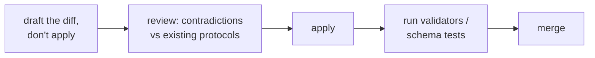

# Agent Consumption: The Docs ↔ Machine Interface

## Problem

A perfectly deployed corpus still fails if the automated consumer isn't *wired* to it: docs the
model reads by luck, routing that depends on tribal knowledge, and summaries pasted into prompts
that drift from the canonical files. The wiring — which files are always loaded, which are looked
up, which are passed as paths — is part of the documentation deployment, not an ops afterthought.

This guide is **system-agnostic**: it states what any documentation corpus must provide so a
machine reader (agent framework, MCP client, CI script, search bot) can consume it. Concrete
product names appear only inside one explicitly conditional section (§5).

## Solution

### 1. The five load tiers

Every artifact a machine consumer reads belongs to exactly one tier, and each tier has a
different budget and rot profile:

| Tier | Load semantics | Budget rule |
|---|---|---|
| **Runtime config** | Declares the wiring itself: which docs are injected, which tools/servers exist, which paths are referenced. | Knobs only — no prose. |
| **Always-loaded** | In every session's context (the entry-point doc, §2). | Must stay short enough to be read whole — depth here is sabotage. |
| **Read-every-turn** | A ritual re-anchored at the start of each turn (the behavior rules). | Restates, never duplicates — anchors into the protocol tier. |
| **Looked-up on demand** | Strategic docs, indexes, details — fetched by path when a task touches them. | Unlimited depth; the cost model is *per lookup*, so one topic per file pays off. |
| **Machine contracts** | Structured returns for handoffs between components (JSON/schemas), never prose. | A handoff you can't validate is a handoff that silently degrades. |

### 2. The pipeline the docs feed

Any nontrivial machine reading loop has two analysis stages, and **the docs are the ground truth
both stages consult**:

- **Normalize** — the raw request is reconciled against the corpus vocabulary *before* any
  reading or answering: every ambiguous term either resolves to a concrete source file or
  surfaces as an explicit open question. Never resolved from general knowledge — that's how
  hallucinated paths are born.
- **Reduce** — the normalized request becomes a scope: which modules are in/out, which files
  carry it, how success is verified. Routing (who does the work) happens *after* reduce, and the
  routing seat never does the work itself — that separation is the core failure-mode guard.

### 3. The five wiring rules

1. **Vocabulary must have lookup targets.** A consumer can only resolve what the corpus states.
   A term that no slice row, no tag index, and no context doc mentions is a *documentation* gap,
   not a model problem. Write descriptions with the words questions arrive in (same logic as
   tags/aliases for grep in [05-agent-navigation.md](05-agent-navigation.md)).
2. **Pass exact paths, never digested summaries.** "Read `docs/context/x.md` before
   implementing" — not a paraphrase of it. Summaries lose nuance, go stale, and create second
   truths. Corollary: docs must be self-sufficient when addressed by path — one topic per file,
   fixed section headings so a `path#Lline` or heading range can quote precisely.
3. **Handoffs are schemas, content is markdown.** Inter-component returns have declared shapes
   (status, decisions, files touched, open questions, resume instructions). Docs carry the facts;
   schemas carry them across boundaries.
4. **Rules live in one protocol file; everything else anchors to it.** Copying protocol text
   into component prompts creates two truths that drift. Dead anchor = silently broken behavior —
   cross-reference integrity is a review target (the dangling-target and dangling-link checks
   apply to machine-facing docs too).
5. **Failure is loud by contract.** A broken consumer component must report and stop; absorbing
   the failure with a workaround hides a broken runtime that degrades every session unobserved.

### 4. Changes to the wiring are the highest-leverage edits

Interface files (prompts, protocols, config) propagate to every downstream session — and they're
usually drafted by the cheapest model in the stack. The review loop is mandatory for anything
that changes behavior, scope, permissions or routing (single-line typo fixes excepted):

### 5. Reference implementation (conditional — only if you use this agent system)

> **If you use a delivery/orchestrator-style multi-agent system** (an entry-point seat, an
> interpreting pre-step, a coordinating seat), the abstract tiers above map concretely like this:

- Runtime config → the agent runtime's config file (`default_agent`, an
  instructions/context-injection list, MCP servers, ...).
- Always-loaded → `docs/project.md` + the prompt-routing protocol.
- Read-every-turn → the dispatch workflow enforcing the *interpret-first hard gate*.
- Looked-up → `docs/context/*.md`, `docs/protocols/*.md`, the tag index.
- Machine contracts → subagent prompts + schemas (routing packet, agent snapshot).
- Rule 5 → the blocked-delegation STOP protocol; Rule 2 → the skill-loading contract.

Everything else in this guide stands without that system: a CI script that greps the Slices
table, or an MCP server answering from `docs/context/` / `docs/protocols/`, obeys the same five rules.

## When to use

Designing the machine side of any repo, or debugging an agent system that "keeps misunderstanding
the project" — the fault is almost always a tier-4 lookup gap (unresolvable vocabulary, dead
anchor, stale Slices row).

## When not to use

Corpora read by humans only — skip the wiring. And don't over-inject: putting every context doc
in the always-loaded tier "so agents have it" breaks the budget rule; on-demand is a feature.

## Examples

One production wiring (an instance, not the rule): the runtime config injects the entry point
plus one protocol; a dispatch ritual re-anchors the gate each turn; every subagent return is
schema-bound. The abstract shape — tiers, two stages, five rules — is what generalizes.

## Common mistakes

- Injecting everything: 40 KB of context docs in every session — the model skims what it was
  forced to read; on-demand reading is what makes depth usable.
- The routing seat doing work "because delegation felt slow" — the temptation is the documented
  failure mode; the gate exists to remove the deliberation, not to rank it.
- Copying protocol text into component prompts — two truths drifting; anchor instead.
- Free-form handoffs between components: prose packets that change shape per run, so no consumer
  can rely on any field.
- Treating a misroute as "the model's fault" before checking whether any row/tag could have
  resolved the term.

## References

- The file this wiring loads first: [06-project-md.md](06-project-md.md)
- How agents read the *content* corpus (same loop, different audience):
  [05-agent-navigation.md](05-agent-navigation.md)
- The cross-reference checks that protect anchors: [04-validation.md](04-validation.md)
