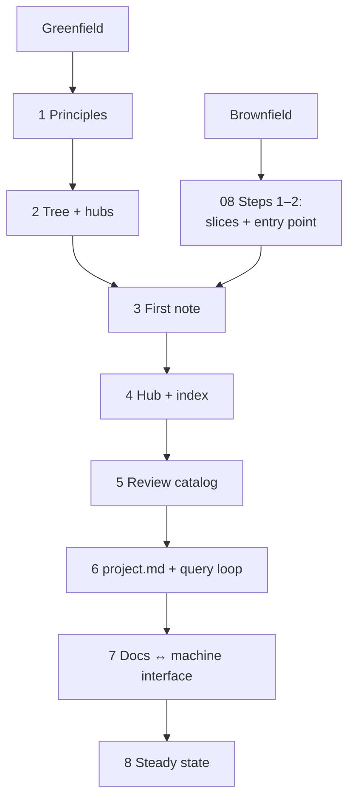

# Bootstrap Workflow: The Agent Runbook

## Problem

Reference material is not a procedure. A cold agent holding nine guidelines (00–08) still has to
invent an order, skip validation, or over-build process before it has any content. The failure mode
is not ignorance of the rules — it is the absence of a sequence. One runbook fixes the order; every
step names what to read and what to check.

## Solution

A branch decision, then an ordered step table. The runbook sequences the other files; it does not
restate them.

**Branch:**

- **Greenfield** — the corpus is born now. Start at Step 1.
- **Brownfield** — code/repo exists before its docs. Run [08-brownfield.md](08-brownfield.md)
  Steps 1–2 (slices + entry point) first, then join this runbook at Step 3.

| # | Do | Read | Check |
|---|---|---|---|
| 1 | Absorb the nine principles. | [00-core-principles.md](00-core-principles.md) | none |
| 2 | Lay out the tree: entry point, folders, hubs, one topic per file; declare `doc_language` in the README. | [01-structure.md](01-structure.md) | run [bootstrap-checklist](../checklists/bootstrap-checklist.md) |
| 3 | Write the FIRST real note before any process. | [02-document-contract.md](02-document-contract.md), [templates/document-template.md](../templates/document-template.md) | [new-note-checklist](../checklists/new-note-checklist.md) |
| 4 | Create the hub for the note's folder; add the generated `index.md` and `tag-index.md` with marker regions. | [03-lifecycle-and-generated-files.md](03-lifecycle-and-generated-files.md) | index region lists every note (the missing-from-hub and stale-index checks in 04) |
| 5 | Adopt the review catalog: walk each changed note against it before merging; the checklists are the mechanism and `node validate.js` is its machine walk where it exists. | [04-validation.md](04-validation.md) | review clean; the catalog walked on every changed note |
| 6 | If an agent will operate in this repo: create `docs/project.md`, audit the query loop. | [06-project-md.md](06-project-md.md), [05-agent-navigation.md](05-agent-navigation.md) | every note reachable in ≤ 3 hops from README |
| 7 | Wire the docs↔machine interface: load tiers, wiring rules. | [07-agent-consumption.md](07-agent-consumption.md) | no dead anchors |
| 8 | Steady state: the contract applies to new and touched files; decisions append as ADRs under `adrs/`; missing areas close via 08's gap-close loop. | [03-lifecycle-and-generated-files.md](03-lifecycle-and-generated-files.md), [08-brownfield.md](08-brownfield.md) | review clean against the catalog |



### Reference instance: a micro-vault

The fence below is the whole corpus as a tree, with the contract-bearing parts shown in full.
It instantiates the contract without pretending to be a second source of truth. Every wikilink
inside the fence is illustrative.

```markdown
corpus/
├── README.md
├── index.md
├── payments/
│   ├── payments-index.md
│   └── payments.md
└── refunds/
    ├── refunds-index.md
    └── refunds.md

---
id: payments-flow
category: payments
tags: [payments, checkout]
aliases: [Payments]
related: [refunds-policy]
version: 1.0
status: active
---

# Payments

How a charge is created, then settles or fails.

## References

- Refund handling: [[refunds]]

---

# Corpus Index

Two topics, one hub each. Enter here — never by guessing paths.

<!-- BEGIN GENERATED: overview -->
- payments/ — hub: [[payments-index]]
  - [[payments]] (`payments-flow`)
- refunds/ — hub: [[refunds-index]]
  - [[refunds]] (`refunds-policy`)
<!-- END GENERATED: overview -->
```

## When to use

- Starting any corpus an agent will read.
- Auditing a corpus that "grew naturally": run the steps and note where it breaks.

## When not to use

- Writing prose depth — that is the notes themselves; this file only sequences them.
- Projects with no documentation corpus.
- Once past Step 8: steady-state edits follow the ratchet ([08-brownfield.md](08-brownfield.md)),
  not this runbook.

## Examples

- The fenced micro-vault above: the contract instantiated in one screen — tree, hub index, one
  note with dual-vocabulary ids (`payments-flow` / `payments`) and a cross-folder `related`.
- [diagrams/documentation-architecture.html](../diagrams/documentation-architecture.html): the
  whole system in one look.

## Common mistakes

1. **Bootstrapping process before the first real note** — there is nothing to check yet;
   ceremony without content is over-build (Step 3 before Steps 4–5, always).
2. **Running steps out of order and back-filling hubs** — the missing-from-hub and stale-index
   findings (notes missing from their hub or the generated index region) are the tax on this shortcut.
3. **Growing the runbook into a tenth-of-a-kind doc** — it sequences files; it does not restate
   them. If a step needs a paragraph of theory, that theory belongs in the guideline it cites.

## References

- [guidelines/00-core-principles.md](00-core-principles.md) — the nine principles Step 1 absorbs.
- [guidelines/01-structure.md](01-structure.md) — tree, hubs, one topic per file (Step 2).
- [guidelines/02-document-contract.md](02-document-contract.md) — the document contract (Step 3).
- [guidelines/03-lifecycle-and-generated-files.md](03-lifecycle-and-generated-files.md) — lifecycle
  and generated-file markers (Steps 4, 8).
- [guidelines/04-validation.md](04-validation.md) — the review catalog (Step 5).
- [guidelines/05-agent-navigation.md](05-agent-navigation.md) — the query loop (Step 6).
- [guidelines/06-project-md.md](06-project-md.md) — `docs/project.md` anatomy (Step 6).
- [guidelines/07-agent-consumption.md](07-agent-consumption.md) — the docs↔machine interface
  (Step 7).
- [guidelines/08-brownfield.md](08-brownfield.md) — the branch entry and the ratchet (Branch, Step 8).
- [templates/document-template.md](../templates/document-template.md) — copyable contract (Step 3).
- [checklists/bootstrap-checklist.md](../checklists/bootstrap-checklist.md) — the Step 2 check.
- [checklists/new-note-checklist.md](../checklists/new-note-checklist.md) — the Step 3 check.
- [diagrams/documentation-architecture.html](../diagrams/documentation-architecture.html) — the
  system in one look.
